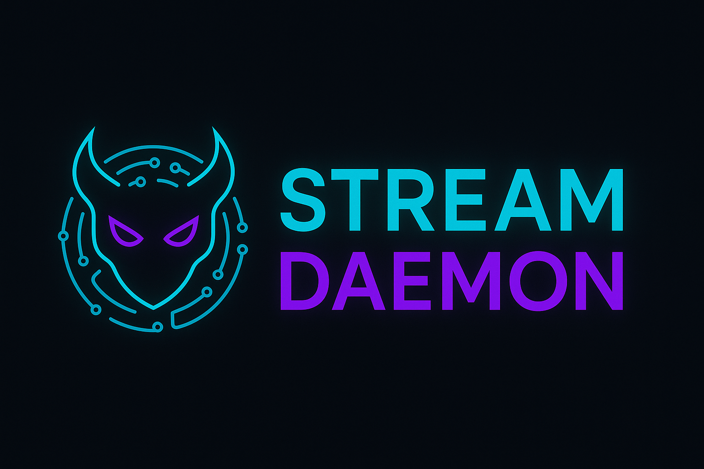
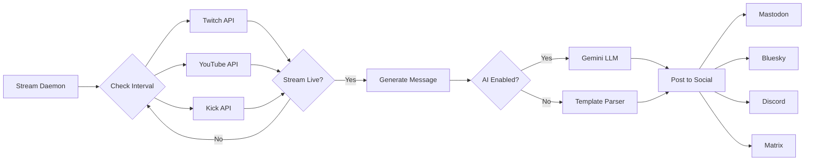

<div align="center">



# Stream Daemon

**Automate your multi-platform live streams with intelligent social media announcements**

*Or: An over-engineered solution to a problem nobody asked us to solve, but we solved it anyway because we could.*

[](https://www.python.org/downloads/)
[](https://www.mozilla.org/en-US/MPL/2.0/)
[](https://github.com/psf/black)

Monitor **Twitch, YouTube, and Kick** streams • Post to **Mastodon, Bluesky, Discord, and Matrix** • AI-powered messages with **Gemini or Ollama**

[Features](#-features) • [Quick Start](#-quick-start) • [Documentation](#-documentation) • [Contributing](#-contributing) • [Author](#-author--socials) • [Support](#-donations-and-tips)

</div>

---

## 🎯 What is Stream Daemon?

Stream Daemon is an enterprise-grade, open-source automation platform for content creators. Monitor your live streams across **Twitch, YouTube, and Kick**, then automatically announce to **Mastodon, Bluesky, Discord, and Matrix** when you go live or end your stream.

### Why Stream Daemon?

- 🤖 **AI-Powered Messages** - Gemini or Ollama generates unique, engaging announcements for every stream
- � **Enterprise Security** - Doppler, AWS Secrets Manager, HashiCorp Vault integration
- 🌐 **7 Platform Support** - Streaming: Twitch, YouTube, Kick | Social: Mastodon, Bluesky, Discord, Matrix
- 📊 **Discord Rich Embeds** - Real-time viewer counts, live thumbnails, in-place updates
- 🎯 **Smart Multi-Platform** - Stream to multiple platforms? Choose combined, threaded, or separate announcements
- 🐳 **Production Ready** - Docker, Docker Compose, systemd service support
- ⚡ **Lightweight** - Runs on anything from Raspberry Pi to AWS Lambda

---

## 🎭 A Note on AI-Generated "Authenticity"

**Or: Teaching Machines to Pretend They Give a Shit About Your Minecraft Stream**

### CRITICAL CLARIFICATION: What Does "George Carlin Persona" Mean Here?

Before you freak out thinking your stream bot is going to start cursing at your audience:

**NO, the AI does NOT generate profane announcements.**

Your stream posts will be normal, professional messages like:
- "Playing Valorant ranked! Come join the climb 🎮 #Valorant #Competitive #FPS"
- "Thanks for watching! See you next stream #Minecraft #GG"

They will **NOT** be:
- "Streaming some Valorant bullshit, come watch if you give a fuck"
- "Thanks for wasting 3 hours watching me play video games"

**George Carlin's voice is in the CODE, not in your announcements.**

The profanity and social commentary are in:
- ✅ Code comments and docstrings
- ✅ Documentation and configuration files
- ✅ This README
- ❌ NOT in the AI-generated stream announcements

We're being honest about what this software does (automates fake enthusiasm), but we're not sabotaging your social media presence.

---

### The Absurdity Explained

Look, let's be honest about what's happening here. For thousands of years, we taught humans to read and write. We fought wars over literacy. We built entire civilizations on the written word. And now? Now we're paying computers to pretend they're excited about your Fortnite stream.

Think about that for a fucking second. We built machines that can process billions of calculations per second, that can simulate nuclear explosions and model climate change, and we're using them to write "OMG going live with some epic Valorant gameplay! 🎮 Come hang out! #Valorant #Gaming #Live"

The best part? We have to **explicitly program** the AI not to sound like a bot:
- "Don't say INSANE!"
- "Don't say EPIC!"
- "Don't use the streamer's name in the hashtags!"
- "Count to 3. Not 2. Not 4. Exactly 3 hashtags."

Yes, we literally have to teach a computer how to count. Welcome to the fucking future.

But here's the thing - it works. And that's either beautiful or terrifying, I honestly can't decide. We've created a system where machines generate "authentic" social media posts, which is perfect because social media was never authentic to begin with. It's artificial authenticity all the way down. It's bullshit turtles on a bullshit turtle stack.

So go ahead, use the AI. Let it announce your streams. Let it pick the hashtags. Let it pretend to care about your 12-hour Final Fantasy XIV marathon. Because at the end of the day, you're just automating what influencers have been faking for years anyway.

The only difference? The machine doesn't pretend it has feelings about it. It doesn't lie to you. It doesn't tell you it "loves your content" while secretly wanting to die. It's honest dishonesty. It's authentic inauthenticity.

**Want to disable this beautiful absurdity?** Set `LLM_ENABLE=false` and go back to the good old days of manually copy-pasting the same announcement template you've used for 3 years. At least that's honest dishonesty.

---

## ✨ Features

### 🎥 Streaming Platform Monitoring
- **Twitch** - OAuth 2.0 with async API support, rate limiting, comprehensive error handling
- **YouTube Live** - Auto-resolves channel from @handle or channel ID, quota-aware with retry logic
- **Kick** - OAuth 2.0 authentication required, 2FA-enabled developer portal access
- **Multiple Streams Per Platform** (NEW!) - Monitor multiple streamers simultaneously
  - Track 3-5 streamers per platform (e.g., `TWITCH_USERNAME=user1,user2,user3`)
  - Independent state tracking for each stream
  - **100% backward compatible - no config changes required**
  - Works with existing `PLATFORM_USERNAME` variables

### 📱 Social Media Publishing
- **Mastodon** - Post to any Mastodon-compatible instance (Mastodon, Hometown, Pleroma, etc.)
- **Bluesky** - Native AT Protocol support with automatic link cards and metadata
- **Discord** - Advanced rich embed system:
  - Real-time viewer counts and live stream thumbnails
  - In-place embed updates (no duplicate posts!)
  - Customizable role mentions per platform (@Twitch Viewers, @YouTube Fans, etc.)
  - "Stream ended" messages with VOD links and statistics
  - Per-platform webhook support
- **Matrix** - Bot integration with room posting:
  - Token or password authentication
  - Custom display names and avatars
  - Homeserver configuration support
  - Message retry with exponential backoff

### 🤖 AI-Powered Messaging (NEW!)
**Two AI Provider Options:**

#### **Option 1: Ollama (Local LLM) - RECOMMENDED** 🌟
- **100% Private** - Your stream data never leaves your network
- **Zero API Costs** - Unlimited usage, no quotas
- **Fast** - Sub-second response times with proper hardware
- **Offline Capable** - Works without internet connection
- **Multiple Models** - gemma2, llama3.2, qwen2.5, mistral, phi3, and more
- **Multi-GPU Support** - Mix different GPU models with [FrankenLLM](https://github.com/ChiefGyk3D/FrankenLLM)
- **Easy Setup** - `curl -fsSL https://ollama.com/install.sh | sh && ollama pull gemma2:2b`

#### **Option 2: Google Gemini (Cloud API)**
- **No Local Resources** - Runs entirely in the cloud
- **Easy Setup** - Just get an API key from Google AI Studio
- **High Quality** - Advanced language models with excellent output
- **Pay Per Use** - ~$0.0001 per announcement with Gemini 2.0 Flash Lite
- **Rate Limits** - 10-30 RPM depending on model tier

**Common Features (Both Providers):**
- Platform-aware character limits (Bluesky: 300, Mastodon: 500, Discord: 2000)
- Automatic hashtag generation from stream titles and game names
- Dynamic, personalized messages that never repeat
- Graceful fallback to static messages if AI unavailable
- Configurable retry logic for reliability

**🛡️ Built-in AI Guardrails (NEW!):**
- **Post-generation validation** - Catches common AI mistakes (wrong hashtag counts, clickbait words, hallucinated details)
- **Auto-retry with strict mode** - If validation fails, retries once with stricter instructions
- **Username protection** - Automatically removes username parts from hashtags
- **Hallucination detection** - Blocks invented details like "drops enabled", viewer counts, giveaways
- **Forbidden word filtering** - Prevents cringe words (INSANE, EPIC, SMASH, etc.)
- **Quality logging** - Clear visibility into issues and retry outcomes
- See [docs/features/llm-guardrails.md](docs/features/llm-guardrails.md) for full details

### 🔐 Enterprise-Grade Secrets Management
- **Doppler** - Modern secrets platform with environment-specific tokens (dev/staging/prod)
- **AWS Secrets Manager** - Secure cloud-based credential storage with IAM integration
- **HashiCorp Vault** - Self-hosted secrets with dynamic credentials and audit logging
- **Priority System** - Secrets managers override environment variables for maximum security
- **Fallback Chain** - Doppler → AWS → Vault → Environment variables

### 🎨 Message Customization
- **Platform-Specific Messages** - Different announcements for each platform (Twitch, YouTube, Kick)
- **Template Variables** - Dynamic content: `{url}`, `{title}`, `{game}`, `{viewers}`, `{platform}`
- **INI-Style Configuration** - Simple `[DEFAULT]`, `[TWITCH]`, `[YOUTUBE]`, `[KICK]` sections
- **Live & End Messages** - Separate templates for "going live" and "stream ended" announcements
- **Toggle Control** - Use platform-specific messages or unified DEFAULT messages

### 🌐 Multi-Platform Streaming Strategies
When streaming to multiple platforms simultaneously (e.g., Twitch + YouTube + Kick):

**Live Announcements:**
- **Separate** - Individual posts per platform ("Live on Twitch!" "Live on YouTube!")
- **Thread** - Reply chain of announcements ("Live on Twitch!" → "Also on YouTube!")
- **Combined** - Single post for all platforms ("Live on Twitch, YouTube, and Kick!")

**Stream Ended Announcements:**
- **Disabled** - No end messages
- **Separate** - Individual end posts per platform
- **Thread** - Reply to each platform's live announcement with end message
- **Combined** - Single end message per platform
- **Single When All End** - Wait until ALL platforms offline (perfect for handling crashes gracefully!)

### 🐳 Deployment Flexibility
- **Docker** - Production-ready containerized deployment
- **Docker Compose** - Multi-container orchestration with health checks
- **Systemd** - Native Linux service integration
- **Bare Metal** - Direct Python execution
- **Cloud Platforms** - AWS Lambda, Google Cloud Run, Azure Functions ready
- **Kubernetes** - ConfigMap and Secrets support

---

## 🚀 Quick Start

### Prerequisites

- **Python 3.10+** (3.11+ recommended)
- API credentials for at least one streaming platform (Twitch, YouTube, or Kick)
- Credentials for at least one social platform (Mastodon, Bluesky, Discord, or Matrix)
- (Optional) [Doppler account](https://doppler.com) for enterprise secrets management
- (Optional) AI provider: [Ollama](https://ollama.com) (local, free) or [Google AI Studio](https://aistudio.google.com) (cloud)

### 5-Minute Setup

1. **Clone and install**
   ```bash
   git clone https://github.com/ChiefGyk3D/Stream-Daemon.git
   cd Stream-Daemon
   pip install -r requirements.txt
   ```

2. **Configure secrets** ⭐ NEW!
   ```bash
   # Interactive wizard for setting up credentials
   ./scripts/create-secrets.sh
   ```
   
   Choose your secrets platform:
   - **Doppler** (recommended) - Modern cloud secrets with environment support
   - **AWS Secrets Manager** - Secure cloud storage with IAM integration
   - **HashiCorp Vault** - Self-hosted enterprise secrets
   - **.env file** - Quick local development
   
   The wizard will guide you through configuring all platforms interactively.

3. **Run!**
   ```bash
   python3 stream-daemon.py
   
   # Or with Doppler
   doppler run -- python3 stream-daemon.py
   ```

That's it! Stream Daemon will now monitor your streams and post announcements automatically.

4. **(Optional) Setup Ollama for AI-Generated Messages** 🤖
   ```bash
   # On your LLM server (can be same machine or remote):
   curl -fsSL https://ollama.com/install.sh | sh
   ollama pull gemma2:2b  # Or gemma3:4b for better quality
   ollama serve
   
   # In your .env file:
   LLM_ENABLE=True
   LLM_PROVIDER=ollama
   LLM_OLLAMA_HOST=http://localhost  # Or your server IP
   LLM_OLLAMA_PORT=11434
   LLM_MODEL=gemma2:2b
   
   # Test it:
   python3 tests/test_ollama.py
   ```

📖 **Documentation:**
- **[Secrets Wizard Guide](docs/configuration/secrets-wizard.md)** - Full setup tool documentation
- **[AI Messages Guide](docs/features/ai-messages.md)** - Complete Ollama & Gemini setup
- **[Ollama Migration](docs/features/ollama-migration.md)** - Switching from Gemini to Ollama

### Docker Quick Start

**Option 1: Use Pre-Built Image from GitHub Container Registry (Recommended)**

```bash
# Pull the latest image
docker pull ghcr.io/chiefgyk3d/stream-daemon:latest

# Run with environment file
docker run -d \
  --name stream-daemon \
  --restart unless-stopped \
  --env-file .env \
  -v $(pwd)/messages.txt:/app/messages.txt \
  -v $(pwd)/end_messages.txt:/app/end_messages.txt \
  ghcr.io/chiefgyk3d/stream-daemon:latest

# View logs
docker logs -f stream-daemon
```

**Option 2: Use Docker Hub**

```bash
docker pull chiefgyk3dx/stream-daemon:latest
docker run -d \
  --name stream-daemon \
  --restart unless-stopped \
  --env-file .env \
  chiefgyk3dx/stream-daemon:latest
```

**Option 3: Build from Source**

```bash
# Clone the repository
git clone https://github.com/ChiefGyk3D/Stream-Daemon.git
cd Stream-Daemon

# Build the Docker image
docker build -f Docker/Dockerfile -t stream-daemon:local .

# Run with environment file
docker run -d \
  --name stream-daemon \
  --restart unless-stopped \
  --env-file .env \
  -v $(pwd)/messages.txt:/app/messages.txt \
  -v $(pwd)/end_messages.txt:/app/end_messages.txt \
  stream-daemon:local

# View logs
docker logs -f stream-daemon
```

**Option 4: Docker Compose (Build or Pull)**

```bash
cd Docker
# Copy the example configuration
cp docker-compose.example.yml docker-compose.yml

# Edit docker-compose.yml with your credentials
# Use 'image: ghcr.io/chiefgyk3d/stream-daemon:latest' to pull pre-built
# Or use 'build: context: .. dockerfile: Docker/Dockerfile' to build from source
nano docker-compose.yml

# Start the container
docker-compose up -d

# View logs
docker-compose logs -f stream-daemon
```

### systemd Service (Linux)

Run Stream Daemon as a system service with automatic startup and logging:

```bash
# One-command installation
sudo ./scripts/install-systemd.sh

# Service management
sudo systemctl start stream-daemon    # Start
sudo systemctl stop stream-daemon     # Stop
sudo systemctl status stream-daemon   # Check status
sudo journalctl -u stream-daemon -f   # View logs
```

See [systemd Service Guide](docs/getting-started/systemd-service.md) for full details.

### Full Configuration

For production deployments, comprehensive guides, and advanced features:

📖 **[See Full Documentation](#-documentation)**

- [Getting Started Guide](docs/getting-started/quickstart.md) - Detailed first-time setup
- [Installation Guide](docs/getting-started/installation.md) - All deployment methods
- [**Secrets Wizard** 🪄](docs/configuration/secrets-wizard.md) - Interactive setup tool for all platforms
- [Secrets Management](docs/configuration/secrets.md) - Doppler, AWS, Vault setup

---

## ⚙️ Configuration Overview

Stream Daemon uses **pure environment variables** - perfect for Docker, Kubernetes, and cloud deployments. No config files to manage!

### Quick Configuration Examples

<details>
<summary><b>Streaming Platforms</b></summary>

```bash
# Twitch
TWITCH_ENABLE=True
TWITCH_USERNAME=your_username
TWITCH_CLIENT_ID=your_client_id
TWITCH_CLIENT_SECRET=your_client_secret

# YouTube  
YOUTUBE_ENABLE=True
YOUTUBE_USERNAME=@YourHandle  # Auto-resolves to channel ID!
YOUTUBE_API_KEY=your_api_key

# Kick
KICK_ENABLE=True
KICK_USERNAME=your_username
KICK_CLIENT_ID=your_client_id  # Optional: better rate limits
KICK_CLIENT_SECRET=your_secret
```
</details>

<details>
<summary><b>Social Media Platforms</b></summary>

```bash
# Mastodon
MASTODON_ENABLE=True
MASTODON_INSTANCE_URL=https://mastodon.social
MASTODON_ACCESS_TOKEN=your_access_token

# Bluesky
BLUESKY_ENABLE=True
BLUESKY_HANDLE=yourhandle.bsky.social
BLUESKY_APP_PASSWORD=your_app_password

# Discord
DISCORD_ENABLE=True
DISCORD_WEBHOOK_URL=https://discord.com/api/webhooks/...
DISCORD_ROLE_TWITCH=@Twitch Viewers  # Mention roles
DISCORD_ROLE_YOUTUBE=@YouTube Fans
DISCORD_UPDATE_LIVE_MESSAGE=True  # Live embed updates!

# Matrix
MATRIX_ENABLE=True
MATRIX_HOMESERVER=https://matrix.org
MATRIX_ACCESS_TOKEN=your_token  # OR use password auth
MATRIX_ROOM_ID=!roomid:matrix.org
```
</details>

<details>
<summary><b>Secrets Management (Recommended for Production)</b></summary>

```bash
# Doppler (Recommended)
SECRETS_MANAGER=doppler
DOPPLER_TOKEN=dp.st.dev.xxxx  # Environment-specific token
DOPPLER_CONFIG=dev  # dev, stg, or prd
SECRETS_DOPPLER_TWITCH_SECRET_NAME=twitch
SECRETS_DOPPLER_YOUTUBE_SECRET_NAME=youtube

# AWS Secrets Manager
SECRETS_MANAGER=aws
AWS_REGION=us-east-1
SECRETS_AWS_TWITCH_SECRET_NAME=prod/stream-daemon/twitch

# HashiCorp Vault
SECRETS_MANAGER=vault
SECRETS_VAULT_URL=https://vault.example.com
SECRETS_VAULT_TOKEN=your_vault_token
SECRETS_VAULT_TWITCH_SECRET_PATH=secret/data/stream-daemon/twitch
```

**Priority Chain:** Doppler → AWS → Vault → Environment variables  
Secrets managers always override environment variables for maximum security.

📖 **[Secrets Wizard](docs/configuration/secrets-wizard.md)** - Interactive setup tool (recommended)  
📖 **[Complete Secrets Guide](docs/configuration/secrets.md)** - Manual configuration
</details>

<details>
<summary><b>AI-Powered Messages</b></summary>

```bash
# Google Gemini LLM
LLM_PROVIDER=gemini
GEMINI_API_KEY=your_api_key  # From https://aistudio.google.com

# Platform-specific character limits
LLM_MAX_LENGTH_BLUESKY=300
LLM_MAX_LENGTH_MASTODON=500
LLM_MAX_LENGTH_DISCORD=2000
LLM_MAX_LENGTH_MATRIX=500

# Creativity controls
LLM_TEMPERATURE=0.9  # 0.0-2.0, higher = more creative
LLM_TOP_P=0.95       # Nucleus sampling
```

Cost: ~$0.0001 per message with Gemini 2.0 Flash Lite!  
📖 **[AI Messages Guide](docs/features/ai-messages.md)**
</details>

<details>
<summary><b>Custom Messages</b></summary>

Edit `messages.txt`:
```ini
[DEFAULT]
🔴 I'm live! Come watch: {url}

[TWITCH]
🎮 Live on Twitch! Playing {title}
👉 {url}

[YOUTUBE]
📺 Streaming now on YouTube!
{url}

[KICK]  
⚡ Live on Kick! {url}
```

Configuration:
```bash
MESSAGES_MESSAGES_FILE=messages.txt
MESSAGES_END_MESSAGES_FILE=end_messages.txt
MESSAGES_USE_PLATFORM_SPECIFIC_MESSAGES=True  # Use [TWITCH] vs [DEFAULT]
```

📖 **[Custom Messages Guide](docs/features/custom-messages.md)**
</details>

<details>
<summary><b>Multi-Platform Streaming</b></summary>

```bash
# Live announcements when streaming to multiple platforms
MESSAGES_LIVE_THREADING_MODE=combined
# Options: separate | thread | combined

# Stream ended announcements
MESSAGES_END_THREADING_MODE=thread
# Options: disabled | separate | thread | combined | single_when_all_end
```

**Example:** Streaming to Twitch + YouTube + Kick with `combined`:
- Posts: "🔴 Live on Twitch, YouTube, and Kick!"
- Instead of 3 separate posts

**Pro Tip:** Use `single_when_all_end` to handle platform crashes gracefully!

📖 **[Multi-Platform Guide](docs/features/multi-platform.md)**
</details>

<details>
<summary><b>Timing & Intervals</b></summary>

```bash
# How often to check when OFFLINE (minutes)
SETTINGS_CHECK_INTERVAL=5

# How often to check when LIVE (minutes)  
SETTINGS_POST_INTERVAL=5

# Discord live embed update frequency (seconds)
DISCORD_UPDATE_INTERVAL=60
```
</details>

### 📖 Complete Configuration Reference

For platform-specific setup guides, advanced features, and troubleshooting:  
**[View Full Documentation](#-documentation)**

---

## 📚 Documentation

### 🚀 Getting Started
- **[Quickstart Guide](docs/getting-started/quickstart.md)** - Get up and running in 10 minutes
- **[Installation Guide](docs/getting-started/installation.md)** - All deployment methods (Docker, systemd, bare metal)

### 🎮 Streaming Platforms
- **[Twitch Setup](docs/platforms/streaming/twitch.md)** - OAuth 2.0, client ID/secret, rate limits, troubleshooting
- **[YouTube Live Setup](docs/platforms/streaming/youtube.md)** - API key, channel ID resolution, quota management
- **[Kick Setup](docs/platforms/streaming/kick.md)** - OAuth flow, 2FA requirements, public API fallback

### 📱 Social Media Platforms
- **[Mastodon Setup](docs/platforms/social/mastodon.md)** - Instance URL, access tokens, custom instances
- **[Bluesky Setup](docs/platforms/social/bluesky.md)** - App passwords, handle configuration, AT Protocol
- **[Discord Setup](docs/platforms/social/discord.md)** - Webhooks, rich embeds, role mentions, live updates
- **[Matrix Setup](docs/platforms/social/matrix.md)** - Bot creation, room IDs, authentication methods

### ⚙️ Configuration
- **[Secrets Wizard](docs/configuration/secrets-wizard.md)** 🪄 - Interactive setup tool for all platforms (recommended)
  - Automated Doppler, AWS, Vault, or .env configuration
  - Step-by-step credential collection
  - Supports updating existing configurations
- **[Secrets Management](docs/configuration/secrets.md)** - Manual setup: Doppler, AWS Secrets Manager, HashiCorp Vault
  - Environment-specific Doppler tokens (dev/staging/prod)
  - Priority chain and security best practices
  - Docker integration and testing guides

### ✨ Features
- **[AI-Powered Messages](docs/features/ai-messages.md)** - Google Gemini LLM integration for dynamic announcements
- **[Custom Messages](docs/features/custom-messages.md)** - Platform-specific templates, variables, INI format
- **[Multi-Platform Streaming](docs/features/multi-platform.md)** - Threading modes, combined posts, strategies

### 🔄 Migration & Upgrades
- **[v1 to v2 Migration](docs/migration/v1-to-v2.md)** - Upgrading from twitch-and-toot v1.x

### 📖 Complete Documentation Index
- **[Documentation Index](docs/README.md)** - Browse all guides and references

---

## 🧪 Testing & Validation

Stream Daemon includes a comprehensive test suite using **pytest** to validate your configuration before going into production.

### Quick Test

```bash
# Test all platforms with current configuration
python3 stream-daemon.py --test

# Test specific platform
python3 stream-daemon.py --test --platform twitch
```

### Pytest Test Suite

The modern test suite uses pytest for better organization and coverage. See **[tests/README.md](tests/README.md)** for complete documentation.

```bash
# Install pytest
pip install pytest pytest-asyncio pytest-cov

# Run all tests
pytest tests/ -v

# Run tests by category
pytest tests/ -m streaming      # Twitch, YouTube, Kick
pytest tests/ -m social          # Mastodon, Bluesky, Discord, Matrix
pytest tests/ -m integration     # End-to-end workflows

# Run specific test file
pytest tests/test_config.py -v
pytest tests/test_streaming_platforms.py -v
pytest tests/test_social_platforms.py -v
pytest tests/test_integration.py -v

# Run with coverage
pytest tests/ --cov=stream_daemon --cov-report=html

# Run platform validation tests
pytest tests/test_platform_validation.py -v
```

### Platform Validation Tests

Comprehensive validation tests for all platforms (replaces legacy test_doppler_*.py files):

```bash
# Test all platforms
pytest tests/test_platform_validation.py -v

# Test specific platform
pytest tests/test_platform_validation.py::TestTwitchValidation -v
pytest tests/test_platform_validation.py::TestMastodonValidation -v

# Test by category
pytest tests/test_platform_validation.py -m streaming -v  # All streaming
pytest tests/test_platform_validation.py -m social -v     # All social

# Quick configuration check
pytest tests/test_platform_validation.py::TestAllPlatformsValidation::test_configuration_summary -v -s
```

### What Tests Validate

✅ **Configuration Loading** - Environment variables and .env files  
✅ **Secrets Management** - Doppler/AWS/Vault integration  
✅ **API Authentication** - Valid credentials for each platform  
✅ **Stream Detection** - Live status checking and data retrieval  
✅ **Social Posting** - Message formatting and platform-specific features  
✅ **Security** - Secret masking and safe logging  
✅ **Error Handling** - Graceful degradation on failures  
✅ **Integration** - Complete stream lifecycle workflows  

### Test Output Example

```
🔐 Testing Twitch Integration...
  ✓ Doppler: Successfully fetched secrets
  ✓ Authentication: Valid OAuth token
  ✓ API: Successfully retrieved user data
  ✓ Stream Status: Currently offline
  ✓ Security: No secrets leaked in logs

🎉 All tests passed!
```

**Note:** Tests use real API calls but don't post announcements. Safe to run anytime!

---

## 🏗️ Architecture

Stream Daemon is built with a modular, extensible architecture:

```
stream-daemon.py                    # Main daemon application
├── stream_daemon/                  # Core application package
│   ├── platforms/
│   │   ├── streaming/              # Streaming platform monitors
│   │   │   ├── TwitchPlatform     # Twitch API (async, OAuth 2.0)
│   │   │   ├── YouTubePlatform    # YouTube Data API v3
│   │   │   └── KickPlatform       # Kick OAuth + public API fallback
│   │   └── social/                 # Social media publishers
│   │       ├── MastodonPlatform   # Mastodon API
│   │       ├── BlueskyPlatform    # AT Protocol (Bluesky)
│   │       ├── DiscordPlatform    # Discord webhooks + rich embeds
│   │       └── MatrixPlatform     # Matrix bot API
│   ├── secrets/                    # Secrets management
│   │   ├── DopplerClient          # Doppler SDK integration
│   │   ├── AWSSecretsClient       # AWS Secrets Manager
│   │   └── VaultClient            # HashiCorp Vault
│   └── utils/
│       ├── AIMessageGenerator     # Google Gemini LLM integration
│       └── MessageParser          # Template variable substitution
├── messages.txt                    # Live stream message templates
├── end_messages.txt                # Stream ended message templates
└── Docker/                         # Container deployment files
    ├── Dockerfile
    └── docker-compose.yml
```

### How It Works



**Flow:**
1. **Monitor** - Daemon checks configured streaming platforms every `CHECK_INTERVAL` (default: 5 min)
2. **Detect** - Identifies state changes: offline→live or live→offline
3. **Generate** - Creates announcement using AI (Gemini) or templates
4. **Publish** - Posts to all enabled social platforms **once per state change**
5. **Update** - While live: Discord embeds update with viewer counts, continues checking for stream end
6. **Repeat** - Returns to monitoring when offline

**Smart Posting:** Stream Daemon only posts when stream **state changes**, never spamming followers with duplicate announcements every check cycle.

---

## 🆘 Troubleshooting & Support

### Quick Troubleshooting

<details>
<summary><b>Stream Daemon not detecting when I go live</b></summary>

1. **Verify platform is enabled:**
   ```bash
   # Check environment variables
   echo $TWITCH_ENABLE  # Should be True
   echo $TWITCH_USERNAME
   ```

2. **Test API authentication:**
   ```bash
   python3 stream-daemon.py --test --platform twitch
   ```

3. **Check intervals:**
   ```bash
   # Lower CHECK_INTERVAL for faster detection
   export SETTINGS_CHECK_INTERVAL=1  # Check every 1 minute
   ```

4. **Review logs for errors:**
   ```bash
   # Look for authentication or API errors
   tail -f stream-daemon.log
   ```
</details>

<details>
<summary><b>Announcements not posting to social media</b></summary>

1. **Test social platform authentication:**
   ```bash
   python3 tests/test_mastodon.py
   python3 tests/test_discord.py
   ```

2. **Check platform is enabled:**
   ```bash
   echo $MASTODON_ENABLE  # Should be True
   echo $MASTODON_INSTANCE_URL
   echo $MASTODON_ACCESS_TOKEN  # Should be set
   ```

3. **Verify Discord webhook:**
   ```bash
   # Test webhook URL manually
   curl -X POST -H "Content-Type: application/json" \
     -d '{"content": "Test message"}' \
     "$DISCORD_WEBHOOK_URL"
   ```

4. **Check message template files:**
   ```bash
   # Ensure files exist and are readable
   cat messages.txt
   cat end_messages.txt
   ```
</details>

<details>
<summary><b>Secrets not loading from Doppler/AWS/Vault</b></summary>

1. **Verify secrets manager configuration:**
   ```bash
   echo $SECRETS_MANAGER  # Should be: doppler, aws, or vault
   echo $DOPPLER_TOKEN  # If using Doppler
   echo $DOPPLER_CONFIG  # Should match environment: dev, stg, prd
   ```

2. **Test secret fetching:**
   ```bash
   python3 -c "from doppler_sdk import DopplerSDK; \
     sdk = DopplerSDK(); sdk.set_access_token('$DOPPLER_TOKEN'); \
     print(sdk.secrets.get('twitch'))"
   ```

3. **Check priority chain:**
   - Secrets managers override environment variables
   - If both are set, secrets manager wins
   - See [Secrets Priority Guide](docs/configuration/secrets.md#priority-system)

4. **Verify Doppler token environment:**
   - `dev` tokens only access `dev` secrets
   - Use `prd` token for production deployments
   - See [Doppler Guide](docs/configuration/secrets.md#doppler)
</details>

<details>
<summary><b>Discord embeds not updating</b></summary>

1. **Enable live updates:**
   ```bash
   export DISCORD_UPDATE_LIVE_MESSAGE=True
   ```

2. **Check update interval:**
   ```bash
   export DISCORD_UPDATE_INTERVAL=60  # Update every 60 seconds
   ```

3. **Verify webhook permissions:**
   - Webhook must have permission to edit messages
   - Check Discord server settings

4. **Check for rate limiting:**
   - Discord limits: 30 requests/minute per webhook
   - Lower update interval if hitting limits
</details>

<details>
<summary><b>AI messages not working</b></summary>

1. **Verify Gemini API key:**
   ```bash
   echo $LLM_PROVIDER  # Should be: gemini
   echo $GEMINI_API_KEY  # Should be set
   ```

2. **Test Gemini API:**
   ```bash
   python3 -c "import google.genai; \
     client = google.genai.Client(api_key='$GEMINI_API_KEY'); \
     response = client.models.generate_content(model='gemini-2.0-flash-lite', contents='Say hello'); \
     print(response.text)"
   ```

3. **Check fallback behavior:**
   - If LLM fails, Stream Daemon falls back to static messages
   - Check logs for LLM errors
   - Verify `messages.txt` has valid templates

4. **Verify character limits:**
   ```bash
   export LLM_MAX_LENGTH_BLUESKY=300
   export LLM_MAX_LENGTH_MASTODON=500
   ```
</details>

### Getting Help

- **📖 Documentation** - [Complete guide index](#-documentation)
- **🐛 Bug Reports** - [GitHub Issues](https://github.com/ChiefGyk3D/Stream-Daemon/issues)
- **💬 Questions** - [GitHub Discussions](https://github.com/ChiefGyk3D/Stream-Daemon/discussions)
- **🔍 Search Issues** - Someone may have solved your problem!

### Reporting Bugs

When opening an issue, please include:

1. **Stream Daemon version** - Check `stream-daemon.py` version
2. **Python version** - `python3 --version`
3. **Platform details** - OS, Docker version (if applicable)
4. **Configuration** - Enabled platforms, secrets manager (no actual secrets!)
5. **Error logs** - Relevant error messages (secrets are auto-masked)
6. **Steps to reproduce** - How to trigger the issue

**Example:**
```
**Version:** Stream Daemon v2.0.0
**Python:** 3.11.4
**OS:** Ubuntu 22.04 LTS
**Docker:** 24.0.5

**Configuration:**
- Streaming: Twitch + YouTube
- Social: Mastodon + Discord
- Secrets: Doppler (prd environment)
- AI: Gemini enabled

**Error:**
```
ERROR: Failed to post to Mastodon: 401 Unauthorized
```

**Steps:**
1. Enable Mastodon with invalid token
2. Go live on Twitch
3. Daemon attempts to post, fails with 401
```

### Performance Issues

If Stream Daemon is using too many resources:

1. **Increase check intervals:**
   ```bash
   export SETTINGS_CHECK_INTERVAL=10  # Check every 10 minutes instead of 5
   ```

2. **Disable unused platforms:**
   ```bash
   export KICK_ENABLE=False  # Disable platforms you don't use
   ```

3. **Disable Discord live updates:**
   ```bash
   export DISCORD_UPDATE_LIVE_MESSAGE=False  # Reduce API calls
   ```

4. **Monitor resource usage:**
   ```bash
   # Docker
   docker stats stream-daemon
   
   # Bare metal
   htop  # Filter by 'stream-daemon'
   ```

---

## 🐳 Docker Deployment

### Using Docker Compose (Recommended)

**Option 1: Use Pre-Built Image (Recommended)**

```yaml
version: '3.8'
services:
  stream-daemon:
    image: ghcr.io/chiefgyk3d/stream-daemon:latest  # or chiefgyk3dx/stream-daemon:latest
    container_name: stream-daemon
    restart: unless-stopped
    environment:
      # Secrets Management
      - SECRETS_MANAGER=doppler
      - DOPPLER_TOKEN=${DOPPLER_TOKEN}
      - DOPPLER_CONFIG=prd
      
      # Streaming Platforms
      - TWITCH_ENABLE=True
      - TWITCH_USERNAME=your_username
      - YOUTUBE_ENABLE=True
      - YOUTUBE_USERNAME=@YourHandle
      - KICK_ENABLE=True
      - KICK_USERNAME=your_username
      
      # Social Platforms
      - MASTODON_ENABLE=True
      - BLUESKY_ENABLE=True
      - DISCORD_ENABLE=True
      - MATRIX_ENABLE=True
      
      # AI Messages (optional)
      - LLM_PROVIDER=gemini
    
    volumes:
      - ./messages.txt:/app/messages.txt
      - ./end_messages.txt:/app/end_messages.txt
    
    healthcheck:
      test: ["CMD", "python", "-c", "import sys; sys.exit(0)"]
      interval: 30s
      timeout: 10s
      retries: 3
```

**Option 2: Build from Source**

```yaml
version: '3.8'
services:
  stream-daemon:
    build: 
      context: .
      dockerfile: Docker/Dockerfile
    container_name: stream-daemon
    restart: unless-stopped
    environment:
      # ... same environment variables as above
```

**Deploy:**
```bash
cd Docker

# Copy example configuration
cp docker-compose.example.yml docker-compose.yml

# Edit with your credentials
nano docker-compose.yml

# Start container
docker-compose up -d

# View logs
docker-compose logs -f stream-daemon

# Restart
docker-compose restart

# Stop
docker-compose down
```

**Container Name:** The container will be named `stream-daemon` for easy reference in all Docker commands.

### Available Docker Images

Stream Daemon is published to two container registries:

- **GitHub Container Registry**: `ghcr.io/chiefgyk3d/stream-daemon:latest` (Recommended)
- **Docker Hub**: `chiefgyk3dx/stream-daemon:latest` (Alternative)

Both images are automatically built and published on every release with support for `linux/amd64` and `linux/arm64` platforms.

### Build from Source

```bash
# Clone the repository (if not already cloned)
git clone https://github.com/ChiefGyk3D/Stream-Daemon.git
cd Stream-Daemon

# Build image from source
docker build -f Docker/Dockerfile -t stream-daemon:local .

# Run with environment file
docker run -d \
  --name stream-daemon \
  --restart unless-stopped \
  --env-file .env \
  -v $(pwd)/messages.txt:/app/messages.txt \
  -v $(pwd)/end_messages.txt:/app/end_messages.txt \
  stream-daemon:local

# View logs
docker logs -f stream-daemon

# Enter container for debugging
docker exec -it stream-daemon /bin/bash
```

**Why build from source?**
- Testing local changes before submitting a PR
- Custom modifications for your environment
- Running unreleased features from development branches
- Air-gapped or restricted network environments

### Docker with Secrets Managers

<details>
<summary><b>Doppler Integration</b></summary>

```bash
# Pass Doppler token only, fetch all other secrets from Doppler
docker run -d \
  --name stream-daemon \
  -e SECRETS_MANAGER=doppler \
  -e DOPPLER_TOKEN=dp.st.prd.xxxx \
  -e DOPPLER_CONFIG=prd \
  -e TWITCH_ENABLE=True \
  -e TWITCH_USERNAME=your_username \
  ghcr.io/chiefgyk3d/stream-daemon:latest
```

All credentials (client IDs, secrets, tokens) are fetched securely from Doppler!

📖 **[Doppler Docker Guide](docs/configuration/secrets.md#docker-integration)**
</details>

<details>
<summary><b>AWS Secrets Manager Integration</b></summary>

```bash
docker run -d \
  --name stream-daemon \
  -e SECRETS_MANAGER=aws \
  -e AWS_REGION=us-east-1 \
  -e AWS_ACCESS_KEY_ID=${AWS_ACCESS_KEY_ID} \
  -e AWS_SECRET_ACCESS_KEY=${AWS_SECRET_ACCESS_KEY} \
  -e SECRETS_AWS_TWITCH_SECRET_NAME=prod/stream-daemon/twitch \
  ghcr.io/chiefgyk3d/stream-daemon:latest
```

Or use IAM roles with ECS/EKS for credential-free authentication!
</details>

### Production Deployment Checklist

- [ ] Use `prd` Doppler environment or production AWS/Vault secrets
- [ ] Set `restart: unless-stopped` in docker-compose.yml
- [ ] Mount message template files as volumes
- [ ] Configure health checks
- [ ] Set up log aggregation (Docker logs → CloudWatch/Datadog)
- [ ] Monitor resource usage (CPU/memory limits)
- [ ] Enable auto-updates (Watchtower or manual rebuild schedule)
- [ ] Test secrets rotation procedures

---

## 🤝 Contributing

Contributions make Stream Daemon better! We welcome:

- 🐛 **Bug Reports** - Found an issue? [Open an issue](https://github.com/ChiefGyk3D/Stream-Daemon/issues)
- 💡 **Feature Requests** - Have an idea? [Start a discussion](https://github.com/ChiefGyk3D/Stream-Daemon/discussions)
- 🔧 **Pull Requests** - Want to contribute code? PRs are welcome!
- 📖 **Documentation** - Help improve guides and examples
- 🧪 **Testing** - Try Stream Daemon on different platforms and report findings

### Development Setup

```bash
# Clone repository
git clone https://github.com/ChiefGyk3D/Stream-Daemon.git
cd Stream-Daemon

# Create virtual environment
python3 -m venv venv
source venv/bin/activate  # On Windows: venv\Scripts\activate

# Install dependencies
pip install -r requirements.txt

# Configure test environment
cp .env.example .env
# Add your test credentials

# Run tests
python3 tests/test_doppler_all.py

# Code formatting (we use Black)
pip install black
black stream-daemon.py stream_daemon/
```

### Pull Request Guidelines

1. **Fork** the repository
2. Create a **feature branch** (`git checkout -b feature/amazing-feature`)
3. **Test** your changes thoroughly
4. Follow **Black** code formatting
5. Update **documentation** if needed
6. **Commit** with clear messages (`git commit -m 'Add amazing feature'`)
7. **Push** to your fork (`git push origin feature/amazing-feature`)
8. Open a **Pull Request** with description of changes

### Code Style

- Follow [PEP 8](https://pep8.org/) guidelines
- Use [Black](https://github.com/psf/black) for code formatting
- Add type hints where applicable
- Include docstrings for functions and classes
- Write descriptive commit messages

### Need Help?

- 📖 Read the [Documentation](#-documentation)
- 💬 Join [GitHub Discussions](https://github.com/ChiefGyk3D/Stream-Daemon/discussions)
- 🐛 Search existing [Issues](https://github.com/ChiefGyk3D/Stream-Daemon/issues)

---

## �️ Roadmap

### ✅ Completed (v2.0)
- [x] **Matrix Support** - Post to Matrix rooms with bot integration
- [x] **Discord Rich Embeds** - Live updating embeds with viewer counts and thumbnails
- [x] **AI Message Generation** - Google Gemini LLM integration for dynamic announcements
- [x] **Modular Architecture** - Platform classes extracted to `stream_daemon/platforms/`
- [x] **Multi-Platform Strategies** - Combined, threaded, and separate posting modes
- [x] **Comprehensive Documentation** - Platform guides, feature docs, migration guides

### 🚧 In Progress
- [ ] **Systemd Service Templates** - Easy Linux service installation
- [ ] **Web Dashboard** - Monitor streams and configure settings via web UI
- [ ] **Prometheus Metrics** - Export metrics for monitoring and alerting
- [ ] **Advanced Scheduling** - Custom intervals per platform, quiet hours

### 🔮 Future Enhancements
- [ ] **Additional Social Platforms**
  - Threads (Meta)
  - X/Twitter (API permitting)
  - LinkedIn
  - Telegram channels
- [ ] **Streaming Platform Expansion**
  - Facebook Gaming
  - Trovo
  - DLive
- [ ] **Advanced Features**
  - Webhooks for stream events
  - Stream analytics and reporting
  - Multi-language message templates
  - Clip sharing to social media
  - VOD announcements
  - Schedule-aware posting (don't announce late-night streams)
- [ ] **Enterprise Features**
  - Multi-tenant support (manage multiple streamers)
  - RBAC (role-based access control)
  - Audit logging
  - SSO integration

### 💡 Community Requests

Have a feature idea? [Open a discussion](https://github.com/ChiefGyk3D/Stream-Daemon/discussions) or vote on existing proposals!

---

## ⚠️ Known Limitations & Considerations

### Platform Limitations

**Kick.com Link Previews**
- CloudFlare security blocks metadata scraping for link preview cards
- Kick URLs remain **fully clickable** in all posts
- Rich preview cards (thumbnails, titles) **not available** for Kick on Bluesky
- Mastodon preview support varies (depends on whether Kick blocks Mastodon's servers)
- ✅ Twitch and YouTube work perfectly with full preview cards

**YouTube API Quotas**
- YouTube Data API has daily quota limits (10,000 units/day by default)
- Each channel lookup: ~3 units, stream check: ~1 unit
- Default 5-minute intervals: ~288 checks/day (~288 units)
- Stream Daemon is quota-efficient but be aware if running multiple instances
- 📖 See [YouTube Setup Guide](docs/platforms/streaming/youtube.md#quota-management)

**Kick OAuth Requirements**
- Kick OAuth requires 2FA enabled on your account
- Initial authentication must be done interactively (can't be fully automated)
- Public API fallback available without OAuth (higher rate limits with auth)
- 📖 See [Kick Setup Guide](docs/platforms/streaming/kick.md#oauth-authentication)

### Discord Limitations

**Webhook Permissions**
- Cannot edit or delete messages sent by other bots/users
- Rate limited to 30 requests per minute per webhook
- Embeds have size limits (6000 characters total)
- Cannot pin messages or manage reactions via webhooks

**Live Embed Updates**
- Updates happen via message edit (requires storing message ID)
- If daemon restarts while stream is live, tracking is lost
- Recommendation: Use persistent storage for message IDs (planned feature)

### Matrix Limitations

**Message Size**
- Some Matrix servers impose message size limits (typically 64KB)
- Long messages may be truncated or rejected
- Use `LLM_MAX_LENGTH_MATRIX` to control AI-generated message length

**Authentication**
- Access tokens don't expire but can be revoked
- Password authentication creates new session each restart
- Recommendation: Use access tokens for production deployments

### General Limitations

**State Persistence**
- Daemon tracks stream state in memory only
- Restart during live stream will re-post "going live" announcement
- Planned: Redis/SQLite state persistence

**Network Reliability**
- Temporary API outages may cause missed stream state changes
- No automatic retry for failed posts (logged as errors)
- Recommendation: Monitor logs and set up alerting

**Time Zones**
- All times logged in UTC by default
- Discord timestamps auto-convert to user's local time
- Other platforms show times as posted

### Security Considerations

**Credentials Storage**
- Environment variables visible to all processes with same user
- **Strongly recommend** using Doppler/AWS/Vault for production
- Docker containers should use secrets management, not .env files

**API Keys in Logs**
- All secrets are automatically masked in logs
- Test outputs show `***MASKED***` instead of actual credentials
- Always review logs before sharing publicly

### Performance Considerations

**Resource Usage**
- Minimal CPU usage (< 1% idle, ~5% during checks)
- Memory footprint: ~50-100MB depending on enabled platforms
- Network: ~1-5KB per check cycle
- Safe for Raspberry Pi, VPS, or cloud deployments

**Check Intervals**
- Default 5-minute intervals balance responsiveness vs API usage
- Lower intervals = faster detection but higher API usage
- Recommendation: 5 minutes for most users, 1-2 minutes for time-sensitive needs

---

## 📄 License

Stream Daemon is licensed under the **Mozilla Public License 2.0 (MPL 2.0)**.

### What This Means

✅ **You CAN:**
- Use Stream Daemon commercially
- Modify the source code
- Distribute your modifications
- Use it privately
- Use it for patent grants

⚠️ **You MUST:**
- Disclose source of MPL-licensed files
- Include the original license and copyright
- State significant changes made to the code
- Release modifications under MPL 2.0 (file-level copyleft)

❌ **You CANNOT:**
- Hold the authors liable
- Use contributors' names for endorsement

### Why MPL 2.0?

The Mozilla Public License 2.0 is a middle ground between permissive licenses (like MIT) and strong copyleft licenses (like GPL):

- **File-level copyleft** - Only modified MPL files must stay open source
- **Commercial friendly** - Can combine with proprietary code
- **Patent protection** - Grants patent license from contributors
- **Simple compliance** - Just keep MPL files open and attributed

### Commercial Licensing

For organizations that cannot comply with MPL 2.0 terms, commercial licensing is available. Contact **ChiefGyk3D** for inquiries.

📄 **[Full License Text](LICENSE.md)**

---

## 🙏 Acknowledgments

Stream Daemon is built on the shoulders of giants:

### Core Dependencies
- **[TwitchAPI](https://github.com/Teekeks/pyTwitchAPI)** - Excellent Python Twitch API wrapper
- **[Google Generative AI](https://ai.google.dev/)** - Gemini LLM for AI-powered messages
- **[Doppler Python SDK](https://github.com/DopplerHQ/python-sdk)** - Enterprise secrets management
- **[Boto3](https://github.com/boto/boto3)** - AWS SDK for Secrets Manager
- **[HVAC](https://github.com/hvac/hvac)** - HashiCorp Vault client

### Platform Libraries
- **[Mastodon.py](https://github.com/halcy/Mastodon.py)** - Mastodon API client
- **[atproto](https://github.com/MarshalX/atproto)** - Bluesky AT Protocol SDK
- **[matrix-nio](https://github.com/poljar/matrix-nio)** - Matrix client library

### Inspiration & Community
- **Open-source streaming community** - For driving innovation in content creation tools
- **All contributors** - Every PR, issue, and discussion makes Stream Daemon better
- **Early adopters** - For testing, feedback, and feature requests

### Special Thanks
- **Doppler** - For providing excellent secrets management platform and documentation
- **GitHub Copilot** - For assistance with code generation and documentation
- **Python community** - For creating an amazing ecosystem

---

## 💬 Community & Support

### Get Involved

- **⭐ Star the repo** - Show your support!
- **📢 Share** - Tell other streamers about Stream Daemon
- **🐛 Report bugs** - Help us improve quality
- **💡 Request features** - Share your ideas
- **🔧 Contribute** - Submit pull requests
- **📖 Improve docs** - Help others get started

### Community Channels

- **[GitHub Discussions](https://github.com/ChiefGyk3D/Stream-Daemon/discussions)** - Ask questions, share setups
- **[GitHub Issues](https://github.com/ChiefGyk3D/Stream-Daemon/issues)** - Bug reports and feature requests
- **[Pull Requests](https://github.com/ChiefGyk3D/Stream-Daemon/pulls)** - Contribute code and improvements

### Stay Updated

- **Watch releases** - Get notified of new versions
- **Follow development** - Track progress on roadmap items
- **Join discussions** - Participate in feature planning

---

## 💝 Donations and Tips

If you find Stream Daemon useful, consider supporting development:

**Donate**:

<div align="center">
  <table>
    <tr>
      <td align="center"><a href="https://patreon.com/chiefgyk3d?utm_medium=unknown&utm_source=join_link&utm_campaign=creatorshare_creator&utm_content=copyLink" title="Patreon"></a></td>
      <td align="center"><a href="https://streamelements.com/chiefgyk3d/tip" title="StreamElements"></a></td>
    </tr>
    <tr>
      <td align="center">Patreon</td>
      <td align="center">StreamElements</td>
    </tr>
  </table>
</div>

### Cryptocurrency Tips

<div align="center">
  <table style="border:none;">
    <tr>
      <td align="center" style="padding:8px; min-width:120px;">
        
      </td>
      <td align="left" style="padding:8px;">
        <b>Bitcoin</b><br/>
        <code style="font-size:12px;">bc1qztdzcy2wyavj2tsuandu4p0tcklzttvdnzalla</code>
      </td>
    </tr>
    <tr>
      <td align="center" style="padding:8px; min-width:120px;">
        
      </td>
      <td align="left" style="padding:8px;">
        <b>Monero</b><br/>
        <code style="font-size:12px;">84Y34QubRwQYK2HNviezeH9r6aRcPvgWmKtDkN3EwiuVbp6sNLhm9ffRgs6BA9X1n9jY7wEN16ZEpiEngZbecXseUrW8SeQ</code>
      </td>
    </tr>
    <tr>
      <td align="center" style="padding:8px; min-width:120px;">
        
      </td>
      <td align="left" style="padding:8px;">
        <b>Ethereum</b><br/>
        <code style="font-size:12px;">0x554f18cfB684889c3A60219BDBE7b050C39335ED</code>
      </td>
    </tr>
  </table>
</div>

---

<div align="center">

Made with ❤️ by [ChiefGyk3D](https://github.com/ChiefGyk3D)

## Author & Socials

<table>
  <tr>
    <td align="center"><a href="https://social.chiefgyk3d.com/@chiefgyk3d" title="Mastodon"></a></td>
    <td align="center"><a href="https://bsky.app/profile/chiefgyk3d.com" title="Bluesky"></a></td>
    <td align="center"><a href="http://twitch.tv/chiefgyk3d" title="Twitch"></a></td>
    <td align="center"><a href="https://www.youtube.com/channel/UCvFY4KyqVBuYd7JAl3NRyiQ" title="YouTube"></a></td>
    <td align="center"><a href="https://kick.com/chiefgyk3d" title="Kick"></a></td>
    <td align="center"><a href="https://www.tiktok.com/@chiefgyk3d" title="TikTok"></a></td>
    <td align="center"><a href="https://discord.chiefgyk3d.com" title="Discord"></a></td>
    <td align="center"><a href="https://matrix-invite.chiefgyk3d.com" title="Matrix"></a></td>
  </tr>
  <tr>
    <td align="center">Mastodon</td>
    <td align="center">Bluesky</td>
    <td align="center">Twitch</td>
    <td align="center">YouTube</td>
    <td align="center">Kick</td>
    <td align="center">TikTok</td>
    <td align="center">Discord</td>
    <td align="center">Matrix</td>
  </tr>
</table>

<sub>ChiefGyk3D is the author of Stream Daemon (formerly Twitch and Toot)</sub>

**If Stream Daemon helps you, consider ⭐ starring the repo!**

</div>
## 🌟 Success Stories

*Using Stream Daemon for your streams? [Share your story](https://github.com/ChiefGyk3D/Stream-Daemon/discussions) and get featured here!*

---

**Stream Daemon** - Automate your multi-platform streaming presence

[⬆ Back to Top](#stream-daemon)

